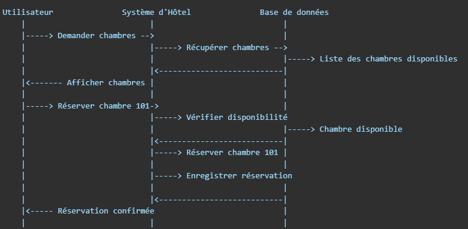

# Diagramme de Séquence 🚀

## Qu'est-ce qu'un Diagramme de Séquence ❓

Un **diagramme de séquence** montre comment différentes parties d'un système (comme des objets ou des classes) interagissent entre elles pour accomplir une tâche. Il montre également dans quel ordre ces interactions se produisent.

En gros, c'est un **scénario** qui décrit étape par étape comment les différentes parties du système s'échangent des informations pour accomplir une action (comme réserver une chambre d'hôtel).

## Exemple Simple 🔄

Imaginons qu'un utilisateur souhaite réserver une chambre dans un hôtel via un site web. Un diagramme de séquence pour cette action pourrait ressembler à ceci :

1. L'**utilisateur** envoie une demande pour voir les chambres disponibles.

2. Le **système d'hôtel** répond avec une liste des chambres disponibles.

3. L'**utilisateur** choisit une chambre et demande à la réserver.

4. Le **système** vérifie si la chambre est disponible et confirme la réservation.

## Schéma Exemple 📊

Voici un tableau représentant les étapes du processus sous forme de diagramme de séquence :

